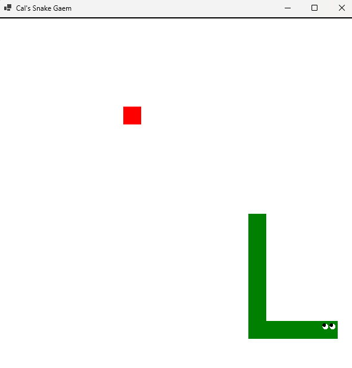

# Snake Game

This is a simple implementation of the classic Snake game using .NET. The game allows players to control a snake that grows in length as it consumes food while avoiding collisions with itself and the game boundaries.

## Project Structure

- **SnakeGame.sln**: Solution file that organizes the project and its components.
- **Program.cs**: Entry point of the application that initializes and starts the game.
- **Game.cs**: Manages the game state, including the game loop, rendering, and input handling.
- **Snake.cs**: Represents the snake, including its position, length, and movement logic.
- **Food.cs**: Represents the food items that the snake can eat, with functionality to spawn food at random locations.
- **SnakeGame.csproj**: Project file containing configuration for the .NET project.

## How to Run the Game

1. Ensure you have the .NET SDK installed on your machine.
2. Clone the repository or download the project files.
3. Navigate to the project directory in your terminal.
4. Run the following command to build the project:
   ```
   dotnet build
   ```
5. After building, run the game using:
   ```
   dotnet run
   ```

## Controls

- Use the arrow keys to control the direction of the snake.
- The objective is to eat the food and grow the snake while avoiding collisions.

## Contributing

Feel free to contribute to this project by submitting issues or pull requests.

## Screenshot



---

For more projects, visit: [https://nestrix-applications.github.io/Nestrix](https://nestrix-applications.github.io/Nestrix/)